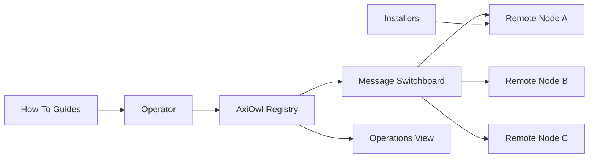
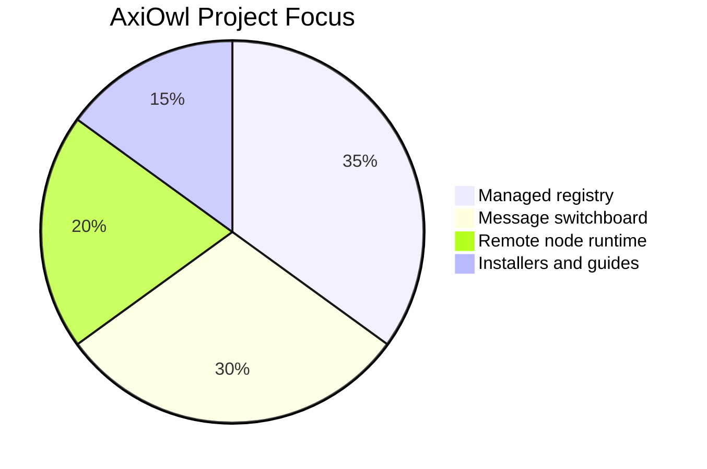
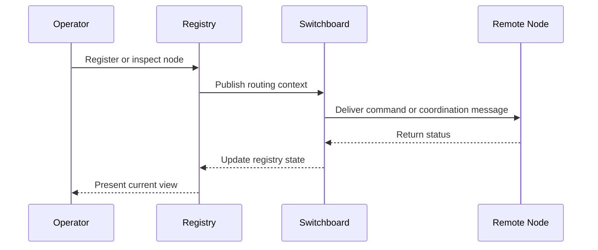

<div align="center">
  

  <h1>AxiOwl</h1>

  <p>
    <strong>Open-source, self-hosted managed registry and message switchboard software for remote nodes.</strong>
  </p>

  <p>
    <a href="https://github.com/morganross/AxiOwl/stargazers"></a>
    <a href="https://github.com/morganross/AxiOwl/commits/main"></a>
    <a href="https://github.com/morganross/AxiOwl/issues"></a>
    
    
  </p>
</div>

---

## What Is AxiOwl?

AxiOwl is the public home for a self-hosted control plane: remote node source code, installers, operating guides, and the managed registry/message switchboard layer that ties them together.

It is designed for builders who want ownership of their infrastructure, clear node coordination, and a practical path from install to operations.

## At A Glance

| Layer | What it does | Why it matters |
| --- | --- | --- |
| Managed registry | Tracks nodes, services, identities, and useful metadata | Gives operators one reliable source of truth |
| Message switchboard | Routes coordination messages between local and remote components | Keeps distributed workflows understandable |
| Remote nodes | Runs the edge-side pieces close to the work | Makes self-hosted deployments flexible |
| Installers | Packages setup into repeatable steps | Reduces drift between machines |
| Guides | Documents setup, operations, and recovery | Keeps the project usable without tribal knowledge |

## System Shape



## Project Focus



## Message Flow



## Repository Guide

```text
.
├── assets/
│   └── axiowl-mascot.svg
└── README.md
```

As source packages, installers, and guides are published, this repository will become the canonical starting point for running and operating AxiOwl.

## Principles

| Principle | Description |
| --- | --- |
| Own the control plane | Operators should be able to self-host the registry and coordination layer. |
| Keep nodes understandable | Remote nodes should be easy to install, inspect, and replace. |
| Prefer repeatability | Setup and recovery should be scripted and documented. |
| Make operations visible | Registry state and message flow should be easy to reason about. |

## Roadmap

| Track | Status |
| --- | --- |
| Remote node source | In progress |
| Installers | In progress |
| Registry documentation | Planned |
| Switchboard documentation | Planned |
| Operator guides | Planned |

## Contributing

Issues and pull requests are welcome once the source layout is published. For now, the best contribution is clear feedback on the project shape, installer expectations, and the workflows that should be documented first.

## Security

If you believe you found a security issue, avoid opening a public issue with sensitive details. Open a minimal private report path with the maintainer first, then share reproduction details once a safe channel is agreed.
