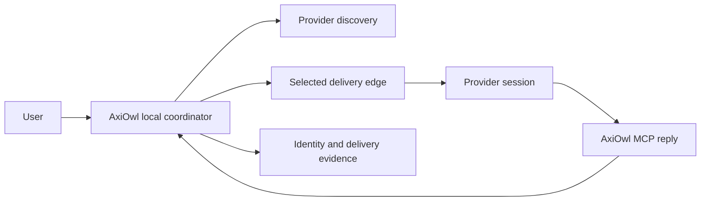

  

  <h1>AxiOwl</h1>

  

    <strong>Open-source local coordination and normalization for AI provider sessions.</strong>
  

  

    
    
    
    
    
  

---

## What Is AxiOwl?

AxiOwl is local software that helps different AI provider surfaces communicate through a shared identity, discovery, delivery, and reply model. It can work with agent windows, editors, VSIX-backed sessions, and command-line providers without pretending that they all expose the same APIs.

It is useful when one workflow spans several providers and you need to know which session received a message, which provider replied, and where a failure occurred.

Documentation site: https://morganross.github.io/AxiOwl/

## At A Glance

| Layer | What it does | Why it matters |
| --- | --- | --- |
| Local coordinator | Normalizes provider discovery, identity, handoff, and replies | Makes different provider surfaces easier to compare and operate |
| Provider integrations | Connects selected editor, agent, and CLI surfaces | Keeps delivery behavior specific to each provider |
| MCP reply path | Lets provider sessions call back with sender metadata | Makes a reply stronger evidence than a display name |
| Installer | Installs selected features and provider-owned integration pieces | Limits changes to what the user chose |
| Security model | Separates encryption, device trust, authorization, replay, and metadata | Prevents a receipt or label from being mistaken for proof |

## System shape

```mermaid
flowchart LR
  user["User"] --> coordinator["AxiOwl local coordinator"]
  coordinator --> discovery["Provider discovery"]
  coordinator --> delivery["Selected delivery edge"]
  delivery --> provider["Provider session"]
  provider --> mcp["AxiOwl MCP reply"]
  mcp --> coordinator
  coordinator --> evidence["Identity and delivery evidence"]
```

## Security in plain English

AxiOwl is designed to protect message content and device trust while keeping routing and provider boundaries explicit. Encryption does not hide every piece of metadata, and it cannot protect a compromised computer or provider account. A device must be trusted before protected work is authorized, and provider-owned identity is stronger than a chat title or alias.

The public security docs intentionally omit private keys, credentials, internal deployment details, and exact cryptographic wire formats.

## Read the docs

Start with the [AxiOwl documentation site](https://morganross.github.io/AxiOwl/docs/intro), then use:

- [Provider Support Matrix](https://morganross.github.io/AxiOwl/docs/reference/provider-support-matrix)
- [Installer Behavior Matrix](https://morganross.github.io/AxiOwl/docs/reference/installer-behavior-matrix)
- [Security And Trust](https://morganross.github.io/AxiOwl/docs/security)
- [Architecture Overview](https://morganross.github.io/AxiOwl/docs/reference/architecture-overview)

## Contributing

Issues and pull requests are welcome. When reporting a provider or security problem, share the smallest useful reproduction and redact credentials, private keys, tokens, personal message content, and private host details.

## Security reports

Do not publish sensitive vulnerability details in a public issue. Contact the maintainer through a private channel first and agree on a safe way to exchange evidence.
