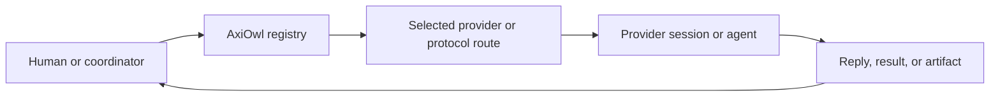

  

  <h1>AxiOwl</h1>

  

    <strong>Bring your AI tools together.</strong>
  

  

    Coordinate provider sessions, A2A agents, AxiOwl hosts, and paired mobile clients through one clear messaging and normalization layer.
  

---

## What Is AxiOwl?

AxiOwl helps people and AI agents find the right session, send focused work through the correct provider integration, follow the handoff, and receive a correlated result.

It works as both:

- a **normalization layer** for providers, surfaces, sessions, targets, receipts, and replies;
- a **communication layer** for local provider packages, MCP, A2A agents, configured nodes, and paired mobile clients.

Documentation site: [axiowl.com/docs](https://axiowl.com/docs/)

## What You Can Build

- cross-provider project teams;
- builder and reviewer workflows;
- reusable specialist sessions;
- external A2A agent integrations;
- AxiOwl-to-AxiOwl task handoffs;
- mobile access to agent sessions running on paired AxiOwl hosts;
- observable workflows with receipts and correlated replies.

## How It Fits Together

```mermaid
flowchart LR
  human["Human or coordinator"] --> registry["AxiOwl registry"]
  registry --> route["Selected provider or protocol route"]
  route --> agent["Provider session or agent"]
  agent --> result["Reply, result, or artifact"]
  result --> human
```

AxiOwl normalizes the boundary while each provider keeps its own authentication, model access, session storage, and delivery behavior.

## Start Here

- [Explore use cases](https://axiowl.com/docs/use-cases/)
- [Understand AxiOwl and AxiOwl Mobile](https://axiowl.com/docs/intro/)
- [See how AxiOwl works](https://axiowl.com/docs/how-it-works/)
- [Install and send a first message](https://axiowl.com/docs/getting-started/)
- [Browse provider surfaces](https://axiowl.com/docs/providers/)
- [Use AxiOwl Mobile](https://axiowl.com/docs/mobile/)
- [Understand security and trust](https://axiowl.com/docs/security/)

## Product Guides

- [Providers](https://axiowl.com/docs/providers/)
- [AxiOwl Mobile](https://axiowl.com/docs/mobile/)
- [Platforms](https://axiowl.com/docs/platforms/)
- [Windows Installer](https://axiowl.com/docs/installer/)
- [Developer Guide](https://axiowl.com/docs/developer/)

## Security

AxiOwl pairs each mobile client to a host daemon with its own identity. Relay traffic is encrypted between the phone and host, while provider credentials and provider processes remain on the computer that owns the agent session.

Sensitive security reports should be shared privately with the maintainer rather than placed in a public issue.
