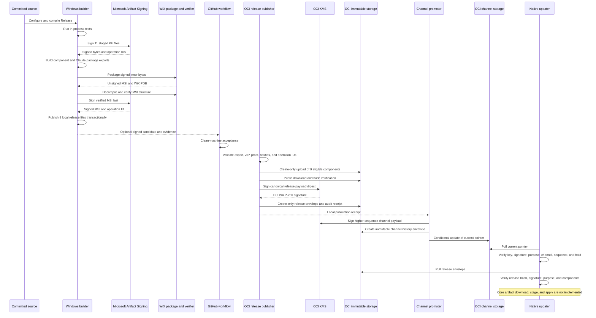

# AxiOwl Update Publication Operator Guide

Last source review: 2026-07-23

This document is the operator source of truth for publishing an AxiOwl Windows
update. It explains the path from a committed source revision to a provider
being able to discover a signed pull update. It also identifies the exact point
where the current implementation stops.

The central distinction is:

- **building and signing** creates final Windows release evidence;
- **publishing** puts immutable signed bytes and signed metadata in OCI;
- **promoting** changes a signed channel pointer;
- **checking** lets a client discover and verify the promoted release;
- **downloading, staging, and applying** changes an installed system.

These are separate authority and failure boundaries. A successful signed MSI
build does not mean that an OCI update is published. An immutable OCI release
does not become available to clients until a channel pointer is promoted.

## Current Bottom Line

The checked-in signed release at commit
`2806c742b77d153275bd9b8a2d7cda7f8ed9d246` proves that the Windows build,
inner PE signing, Claude package assembly, WiX packaging, MSI structural
verification, outer MSI signing, and release evidence export completed. The
evidence says the signed source revision was
`e1725992a0795c267798f65ec800ee6fc2536b33`.

The pull-update publication path is **not production-available today**:

1. The checked-in signed-component manifest and signing proof contain a UTF-8
   BOM, while the Python publication validator opens them as strict `utf-8`.
   Validation currently fails before any OCI call.
2. `requires_processes_stopped` was serialized as a string for update-eligible
   executables and as `{}` for empty values. The locked schema and publisher
   require arrays.
3. The OCI inventory records that the least-privilege publisher and promoter
   identities, Object Storage logging, and first publication remain deployment
   work.
4. Public checks of both `internal` and `stable` currently return HTTP 404 for
   `current.envelope.json`.
5. The native client can verify and record a channel pointer and release
   envelope. It does not yet download, stage, or apply the nine core component
   files.
6. Claude package staging and local apply exist, but provider package
   publication, provider channel discovery, and network download are not
   implemented.
7. The GitHub signed-release workflow does not call the OCI publisher or
   promoter.
8. The intended `internal` then `stable` flow is blocked by a contract
   mismatch. Release payloads and receipts are channel-bound, while component
   object paths are shared across channels and create-only publication rejects
   the already-present identical components. The publisher needs an
   evidence-bound "existing identical object" or promotion-reuse contract.
9. The provider package store has focused native tests, but there is no
   repository test suite for the Python OCI publisher, promoter, hold, or
   public-verification scripts.

Do not promote or advertise a pull update until these blockers are corrected,
new artifacts are built, and every gate in this guide passes.

## Status Matrix

| Stage | Implementation | Evidence or limitation |
|---|---|---|
| Release compile | Implemented | Production builder configures x64 Release and builds serially. |
| Focused in-process tests | Implemented | Production builder runs `ctest -L in_process`; process-spawning tests are disabled. |
| Inner PE Artifact Signing | Implemented | Eleven unique PE files are signed and independently verified. |
| Claude provider package assembly | Implemented | `claude_code_cli` package `1.0.0` contains one signed worker and its manifest. |
| Signed-component export | Implemented, current output incompatible | Contract expects 11 artifacts and 9 update-eligible components; current JSON has BOM and array-shape defects. |
| WiX MSI package | Implemented | MSI is built only after signed inner bytes are copied into staging. |
| Structural MSI verification | Implemented | The MSI is decompiled and 13 first-party PE occurrences plus 2 WiX binaries are checked. |
| Outer MSI signing | Implemented | Structurally verified MSI is signed last and independently verified. |
| Transactional local release export | Implemented | Eight release files are published together, with the MSI last. |
| GitHub clean-machine release gate | Implemented | Signed assets, clean install, upgrade, feature change, repair, uninstall, and Claude package state are checked. |
| GitHub Release asset publication | Implemented for matching `v*` tags | A manual `main` run signs and tests but does not create a GitHub Release. |
| OCI resource inventory | Partly implemented | Compartment, key, and buckets exist; publisher/promoter identities and logging remain pending. |
| Immutable OCI release publisher | Implemented code, blocked in current artifact handoff | Publisher validates, uploads, reads back, KMS-signs, and emits a receipt. Current release fails local validation. |
| OCI publication tests | Not implemented | The Python tools compile, but no checked-in automated publication test suite exists. |
| Channel promotion and hold | Implemented code, not deployed end to end | No public channel pointer exists. |
| Independent public verification | Implemented code | Both current channels return HTTP 404. |
| Native channel/release check | Implemented | Client verifies signatures, purpose, channel, hashes, hold state, and monotonic sequence. |
| Core component download/stage/apply | Planned, not implemented | There is no core `update download` or `update apply` command. |
| Claude package local stage/activate/apply | Implemented | Requires an existing absolute package directory; no network package download exists. |
| Provider package OCI release/channel | Planned, not implemented | The Claude manifest and ZIP are GitHub/build artifacts only. |
| Silent update | Planned, not implemented | No production scheduler applies updates. |
| Push notification | Planned, not implemented | Signed pull remains the intended authority. |

## System Flow



The availability boundary is the conditional write of
`channels/<channel>/current.envelope.json`. Failures before that write may leave
unreferenced immutable evidence in Object Storage, but they do not select a new
release for clients.

## Authority and Responsibility Boundaries

| Owner | Owns | Does not own |
|---|---|---|
| Windows builder | Compilation, tests, staged inner signing, package assembly, WiX build, MSI inspection, outer signing, local evidence export | OCI upload, channel movement, client update decisions |
| Microsoft Artifact Signing | Authenticode signatures and signing operation IDs for PE/MSI bytes | Source correctness, package ownership, OCI metadata |
| WiX | MSI container construction and WiX support binaries | AxiOwl source trust or OCI release selection |
| GitHub workflow | Controlled source checkout, Azure OIDC authentication, clean-runner acceptance, optional GitHub Release assets | OCI release publication or channel promotion |
| OCI release publisher | Validation of final signed exports, immutable component upload, public read-back, release-envelope creation, KMS signing, audit receipt | Compilation, PE signing, channel movement, client apply |
| OCI channel promoter | Higher-sequence signed active or hold pointer and conditional current-pointer update | Building, artifact mutation, release repair |
| OCI Object Storage | Availability of public bytes and retained private evidence | Integrity. Integrity comes from signatures and hashes. |
| OCI KMS | Purpose-bound update envelope signatures using the dedicated key | Authenticode signing, activation signing, client policy |
| Native updater | Pinned-key verification, monotonic channel acceptance, release verification, local status | Current core artifact download/stage/apply |
| Provider package store | Closed-world package validation, immutable local revision, receipt, active pointer, rollback primitive | Provider package network publication or discovery |

The current duplication/manual gap is deliberate in some places and accidental
in others. Signing and promotion should remain separate. GitHub and OCI
publication are currently separate without an automated, evidence-bound
handoff. That gap must be closed or operated explicitly; it must not be hidden
behind a claim that a GitHub Release is an OCI channel release.

## Versions and Source Identity

The core product version comes from [`version.json`](https://github.com/morganross/axiowl-cplus/blob/main/version.json). The
Claude package version comes independently from
[`providers/claude_code_cli/version.json`](https://github.com/morganross/axiowl-cplus/blob/main/providers/claude_code_cli/version.json).

At the reviewed release:

```text
core package_version:       2.0.30
Claude provider_id:         claude_code_cli
Claude package_version:     1.0.0
signed source_git_head:     e1725992a0795c267798f65ec800ee6fc2536b33
signed artifact commit:     2806c742b77d153275bd9b8a2d7cda7f8ed9d246
```

The artifact commit differs from `source_git_head` because the signed binary
outputs and their evidence were committed after building the source revision.
An audit must preserve both identities.

## End-to-End Lifecycle

### 1. Start from committed source

The production builder rejects:

- non-Release configuration;
- `-SkipBuild`;
- `-SkipTests`;
- dirty tracked source;
- untracked source outside its allowlist.

This is enforced by
[`build-windows-msi.ps1`](https://github.com/morganross/axiowl-cplus/blob/main/apps/windows-desktop/installer/build-windows-msi.ps1).
The point is not repository tidiness. The point is to make
`source_git_head` a meaningful provenance claim.

### 2. Compile and test

The production builder performs the equivalent of:

```powershell
cmake -S . -B build -A x64 -DAXIOWL_ENABLE_PROCESS_SPAWN_TESTS=OFF
cmake --build build --config Release --parallel 1
ctest --test-dir build -C Release -L in_process --output-on-failure
```

It also runs the Artifact Signing helper tests. The normal unsigned development
workflow is described in
[`BUILD-AND-TEST.md`](https://github.com/morganross/axiowl-cplus/blob/main/docs/dev-admin/BUILD-AND-TEST.md) and may build a narrow
target without producing a production MSI:

```powershell
cmake -S . -B build -A x64 -DAXIOWL_ENABLE_PROCESS_SPAWN_TESTS=OFF
cmake --build build --config Release --target axiowl
ctest --test-dir build -C Release -L in_process --output-on-failure
```

An unsigned development build is useful for engineering. It is not a release
candidate and must not use the signed production MSI filename.

### 3. Sign inner PE files

The builder copies PE candidates into a run-specific staging directory. It
never asks Artifact Signing to mutate source-tree files or the ordinary
`build/Release` outputs. The exact staged list contains 11 unique files.

[`invoke-artifact-signing.ps1`](https://github.com/morganross/axiowl-cplus/blob/main/apps/windows-desktop/installer/invoke-artifact-signing.ps1)
signs each file and records:

- unsigned SHA-256;
- signed SHA-256;
- Artifact Signing operation ID for every attempt;
- signing tool and dlib identities;
- certificate subject and chain;
- timestamp evidence;
- independent verification output.

[`verify-windows-signatures.ps1`](https://github.com/morganross/axiowl-cplus/blob/main/apps/windows-desktop/installer/verify-windows-signatures.ps1)
requires the exact AxiOwl signer subject, code-signing EKU, Microsoft trust
root, and a valid timestamp. The pinned tool versions and expected hashes are
declared by
[`artifact-signing.settings.json`](https://github.com/morganross/axiowl-cplus/blob/main/apps/windows-desktop/installer/artifact-signing.settings.json)
and resolved by
[`resolve-artifact-signing-tools.ps1`](https://github.com/morganross/axiowl-cplus/blob/main/apps/windows-desktop/installer/resolve-artifact-signing-tools.ps1).

### 4. Generate signed exports and the Claude package

After inner signing, the builder creates:

- the locked signed-component manifest;
- a flat ZIP containing the 11 signed PE files and a byte-identical
  `manifest.json`;
- the Claude provider package manifest;
- a flat Claude ZIP containing only the signed worker and
  `provider-package.json`.

The signed-component export uses component-owned versions. Core and tool
components use `2.0.30`; the Claude worker uses its independently owned
`1.0.0`.

The provider package is configuration-only. Its manifest declares:

```text
provider_id:                    claude_code_cli
package_version:                1.0.0
worker_protocol_version:        1
minimum_core_protocol_version:  1
operating_system:               windows
architecture:                   x86_64
install_strategy:               configuration-only
supported_operations:           send, create, rename, discover,
                                parse_sender_identity, install
required_process_scopes:        []
required_config_scopes:         claude-user-config
payload:                        axiowl-provider-claude-worker.exe
authenticode_required:          true
```

The schemas are:

- [`signed-component-export.schema.json`](https://github.com/morganross/axiowl-cplus/blob/main/services/update/schemas/signed-component-export.schema.json)
- [`provider-package.schema.json`](https://github.com/morganross/axiowl-cplus/blob/main/services/update/schemas/provider-package.schema.json)
- [`installed-provider-receipt.schema.json`](https://github.com/morganross/axiowl-cplus/blob/main/services/update/schemas/installed-provider-receipt.schema.json)

### 5. Build the WiX package

The builder calls WiX 5.0.2 against the staged payload after signed inner bytes
have replaced their unsigned staging copies. It produces an unsigned MSI
candidate and WiX PDB.

### 6. Perform structural verification

The builder decompiles the MSI and verifies product identity, feature
conditions, custom-action sequencing, embedded manifest bindings, and
extracted PE bytes.

There are 13 packaged first-party PE occurrences:

- one occurrence for each of the 11 unique signed PE byte sets;
- a second occurrence of `axiowl-api-service.exe` as
  `axiowl-api-service-helper-source.exe`;
- a second occurrence of `axiowl-relay.exe` as
  `axiowl-relay-helper-source.exe`.

The duplicates are packaging occurrences, not separately signed components.
Their extracted hashes must equal the already-signed originals.

The MSI also embeds two WiX PE binaries. They are verified separately against
the expected WiX/.NET Foundation publisher. They are not counted as AxiOwl
first-party signed PEs.

### 7. Sign the MSI last

Only the structurally verified unsigned candidate is copied into a fresh
signing staging directory. The MSI is then signed once and independently
verified. No package mutation is allowed after this step.

At the reviewed release:

```text
unsigned MSI SHA-256:
c28e24d0bae6bcc0bd8d655f8092b3938bf46c2b4f9856afd79307c6ac028b9f

signed MSI SHA-256:
638b9da79ab157ea368a0c1709717fa312dd5e331b7f507070b0948dfcad0283

outer MSI Artifact Signing operation ID:
4675389a-6f58-4257-a508-629455ddfda8
```

Timestamping makes the signature remain verifiable after the short-lived
signing certificate expires. It also means two correct builds of identical
unsigned bytes will not normally produce byte-identical signed bytes.

### 8. Export local release evidence transactionally

The builder publishes this exact eight-file set under `release/`:

| File | Purpose |
|---|---|
| `axiowl-activation-a2a-windows-installer.msi` | Final signed Windows installer |
| `axiowl-activation-a2a-windows-installer.wixpdb` | WiX package debug/symbol evidence |
| `axiowl-activation-a2a-build-preflight.json` | Build, source, tool, and gate evidence |
| `axiowl-activation-a2a-signing-proof.json` | Durable Authenticode and MSI proof |
| `axiowl-activation-a2a-signed-components.json` | Locked component ownership and update contract |
| `axiowl-activation-a2a-signed-components.zip` | Immutable signed component bytes plus identical manifest |
| `axiowl-activation-a2a-provider-claude_code_cli-package.json` | Claude package contract |
| `axiowl-activation-a2a-provider-claude_code_cli-package.zip` | Claude worker and package manifest |

The MSI is published last. A generated WXS may remain for package inspection,
but it is not one of the eight transactionally published release files. Older
files can also exist in `release/`; directory presence alone is not provenance.
Use the proof and exact names above.

### 9. Publish immutable OCI objects

[`publish_release.py`](https://github.com/morganross/axiowl-cplus/blob/main/services/update/tools/publish_release.py) consumes
final signed bytes. It does not compile, sign, extract from the MSI, repair, or
rewrite them.

After local validation it:

1. selects the 9 components with `update_eligible=true`;
2. uploads each unchanged with create-only semantics;
3. publicly downloads each object and rechecks size and SHA-256;
4. creates a purpose-bound release payload;
5. canonicalizes it;
6. hashes the canonical payload;
7. asks the dedicated OCI KMS key to sign that digest;
8. locally verifies the new signature using the recorded public key;
9. uploads the immutable release envelope with create-only semantics;
10. publicly reads the exact envelope bytes back;
11. writes a create-only private audit receipt;
12. writes the same receipt atomically to the requested local path.

This command does not move a channel.

### 10. Promote a channel

[`promote_channel.py`](https://github.com/morganross/axiowl-cplus/blob/main/services/update/tools/promote_channel.py) consumes
the successful publication receipt. It verifies that the receipt identifies
the expected bucket, release, hashes, key, and public read-back evidence.

Promotion then:

1. creates a signed `active` pointer with a positive sequence;
2. creates an immutable channel-history object first;
3. reads and cryptographically verifies the current pointer when one exists;
4. rejects a sequence that is not greater than the current sequence;
5. writes `current.envelope.json` using the verified current ETag;
6. uses `If-None-Match: *` for the first pointer;
7. publicly reads the current pointer back and requires exact byte equality.

This conditional current-pointer write is the atomic selection operation.

### 11. Client pull and check

The native implementation in
[`update_manager.cpp`](https://github.com/morganross/axiowl-cplus/blob/main/apps/windows-desktop/src/update_manager.cpp) uses
`stable` by default and reads its signed channel pointer from the configured
HTTPS update endpoint. Exact production storage endpoints are intentionally not
published on this public page.

The client:

1. fetches `/<channel>/current.envelope.json`;
2. verifies the pinned ECDSA key and envelope;
3. requires channel-pointer purpose `axiowl-update-channel-v1`;
4. requires exact requested channel;
5. rejects invalid or reused sequences;
6. persists the highest accepted sequence;
7. rejects a signed hold;
8. fetches the release URL from the verified pointer;
9. verifies the envelope SHA-256 bound into the pointer;
10. verifies release purpose `axiowl-update-manifest-v1`;
11. requires matching channel and release version;
12. compares component hashes with installed files;
13. stores the verified pointer, release, and accepted-channel state.

Implemented commands are:

```text
axiowl update status
axiowl update check [--channel <channel>] [--endpoint <channel-base-url>]
axiowl update check --channel-pointer <signed-pointer-envelope.json> \
  --release-envelope <signed-release-envelope.json> [--channel <channel>]
axiowl update provider status claude_code_cli
axiowl update provider apply claude_code_cli \
  --package-root <verified-directory>
```

There is no implemented core `update download`, `update stage`, or
`update apply` command. Therefore the current client flow stops after verified
availability and installed-hash comparison.

## Locked Signed-Component Export Contract

The executable contract is enforced by
[`update_publication_common.py`](https://github.com/morganross/axiowl-cplus/blob/main/services/update/tools/update_publication_common.py),
not by prose.

The top-level manifest has exactly:

```text
schema_version
purpose
product
package_version
component_version_policy
provider_package_versions
source_git_head
created_at
artifacts
```

Every artifact has exactly:

```text
artifact_name
logical_name
component_id
provider
version
update_eligible
installed_logical_name
apply_strategy
requires_processes_stopped
size_bytes
sha256
artifact_signing_operation_id
```

The current contract requires:

- exactly 11 unique artifacts;
- exactly 11 unique component IDs, artifact names, and operation IDs;
- exactly 9 update-eligible artifacts;
- the Claude worker version to equal the independently declared Claude package
  version;
- all other component versions to equal the core package version;
- update-eligible entries to be executable `replace-file` records with exactly
  one matching process name;
- the Claude worker and provider-detection DLL to be non-update-eligible;
- a flat 12-entry ZIP: 11 artifacts plus byte-identical `manifest.json`;
- exact signing-proof binding for both export files and all 11 operation IDs.

### Why older documents say 10

Before the Claude worker package split, the export contained 10 unique signed
PE files: 9 update-eligible executables and the non-updatable provider-detection
DLL. The independently versioned Claude worker added one unique signed PE.
Therefore:

```text
old unique signed PE count:          10
current unique signed PE count:      11
current update-eligible core count:   9
current MSI first-party occurrences: 13
current WiX-owned PE occurrences:     2
```

The number 13 is not another export count. It is the 11 unique signed byte sets
as they occur in the MSI, plus the duplicate API-service and relay
helper-source occurrences.

Publication and audit code must derive counts from current manifest/proof
evidence. Plans and reports with hard-coded 10- or 12-occurrence prose are
historical context, not the current executable contract.

## Current Signed Component Evidence

The following values describe the checked-in `2806c74` artifact set. They are
evidence for this release, not constants for future releases.

| Component | File | Owner | Version | Pull eligible | Size | SHA-256 | Artifact Signing operation ID |
|---|---|---|---|---:|---:|---|---|
| `core.runtime` | `axiowl.exe` | `core` | `2.0.30` | yes | 4,103,928 | `42430941c510b2fdc1d162869b6772eb75fae6f670d72558f5e0b67f8448de26` | `01e012ad-a379-4203-b806-6d258c5e7020` |
| `core.mailbox` | `axiowl-mailbox.exe` | `core` | `2.0.30` | yes | 1,218,296 | `5f829c53ab115fd020b314fb8ac0d1a6638427da100caa42bf9b0e6b4708d4f7` | `f9a85e05-0fb1-4332-b9ac-c65c6c1f305e` |
| `tools.tester` | `axiowl-tester.exe` | `tools` | `2.0.30` | yes | 963,320 | `85be23231de34dfb9dca206392ee245963ed1da401c0e33c297378e95778a0b1` | `5c8020f4-fbfe-4e89-b5b6-7e765ac39b6c` |
| `tools.launch-broker` | `axiowl-test-launch-broker.exe` | `tools` | `2.0.30` | yes | 476,408 | `f6a24db164296a00c69e878bde1c033daad0982402b440f95dc8f891b81153d7` | `98eb0c66-a022-42ea-a96b-50be92949097` |
| `provider.claude_code_cli.worker` | `axiowl-provider-claude-worker.exe` | `claude_code_cli` | `1.0.0` | no | 844,024 | `ca19b4e199c63e04c7e9951838d2cc8fa1e57bcdf7c6fb05007ca88c1462aba5` | `22b59fa5-4eb4-4ec9-bd0a-42c9567723e4` |
| `core.installer.ui` | `axiowl-installer.exe` | `core` | `2.0.30` | yes | 2,619,640 | `4868dd686a6d299087eabf63332874e2cedd19c639c84599e4ff6e88b4888457` | `12f43461-6eb0-4015-98c9-6413fcbdbc3b` |
| `core.installer.silent` | `axiowl-installer-silent.exe` | `core` | `2.0.30` | yes | 265,464 | `cd262bb1f2b3d81427e800383631d9222ab50f3902625d6b107928225fe2bbe4` | `28cda175-ea8c-49fc-8f43-a2a5cd098fec` |
| `core.api-service` | `axiowl-api-service.exe` | `core` | `2.0.30` | yes | 3,306,232 | `9db08d003d317325c98b225632ad6d2a3cae77bda9c3c0385f1234be15413fdc` | `f5f87458-5bd1-4dd4-b080-03594c826115` |
| `core.user-broker` | `axiowl-user-broker.exe` | `core` | `2.0.30` | yes | 3,022,584 | `c91de8a00234b9a309261cbcd0c371e9b402aebb0ef0e3b77fe526d69495aabf` | `2c45f6a2-cf76-4101-8af0-3e9844229649` |
| `core.relay` | `axiowl-relay.exe` | `core` | `2.0.30` | yes | 3,268,344 | `799aa775a1adcf155f79105530bde486b1b23849b92b20b2350cd4da340e21d0` | `60e5432f-a0dd-429b-aa89-0160487e709a` |
| `core.installer.provider-detection` | `axiowl-installer-provider-detect-ca.dll` | `core` | `2.0.30` | no | 697,592 | `f08ef0af3bcafc8dc173e6d9f8389c311b6c3a8ff10ff13c48d48d80f851aa30` | `4ecde67b-4cc0-493d-ab39-88377b4346cc` |

Other release bindings:

```text
signed MSI SHA-256:
638b9da79ab157ea368a0c1709717fa312dd5e331b7f507070b0948dfcad0283

signed-component manifest SHA-256:
1c8b518f2d2fdbeb46d174642b8a49f2977b5b8c4cd4c72e4b1d64ebf56d2315

signed-component archive SHA-256:
555d732820643f0b9a53734349cbfa9976638ed9abff790f4831e08440e4b1cd

Claude provider manifest SHA-256:
3492938ea36f34140ea81a6af07fb7e2458b23d0220988ae82e65344e1a582d9

Claude provider archive SHA-256:
1965b6628910f67868f93389279f6f417dfeca76cb0dbbc5552c391ad752fbdf
```

The authoritative machine-readable sources are:

- [`axiowl-activation-a2a-signing-proof.json`](https://github.com/morganross/axiowl-cplus/blob/main/release/axiowl-activation-a2a-signing-proof.json)
- [`axiowl-activation-a2a-signed-components.json`](https://github.com/morganross/axiowl-cplus/blob/main/release/axiowl-activation-a2a-signed-components.json)
- [`axiowl-activation-a2a-provider-claude_code_cli-package.json`](https://github.com/morganross/axiowl-cplus/blob/main/release/axiowl-activation-a2a-provider-claude_code_cli-package.json)

## OCI Object and Trust Model

Production deployment identifiers, bucket names, tenancy details, regional
endpoints, key identifiers, and retention dates are intentionally omitted from
this public guide. Release operators use the separately controlled deployment
inventory.

The design uses three logically separate storage areas:

| Storage area | Visibility | Purpose |
|---|---|---|
| Immutable release storage | Public read without listing | Signed components, release envelopes, and channel history |
| Channel storage | Public read without listing | Small mutable current-channel pointers |
| Audit storage | Private | Publication receipts and retained release evidence |

Public read access is an availability decision, not an integrity decision.
Clients trust the pinned public key, purpose claims, signatures, hashes,
sequence rules, and local policy.

### Object paths

The conceptual object layout is:

```text
immutable-release-storage/
  artifacts/<component_id>/<version>/<sha256>/<filename>
  releases/<release_version>/<payload_sha256>.envelope.json
  channel-history/<channel>/<sequence>-<payload_sha256>.envelope.json

channel-storage/
  channels/internal/current.envelope.json
  channels/stable/current.envelope.json

private-audit-storage/
  publication-receipts/<release_version>/<payload_sha256>.json
```

The design plan contains an older illustrative audit path under
`publications/`. The executable publisher currently uses
`publication-receipts/`; operators must follow code until the plan and code are
deliberately reconciled.

Immutable component, release, history, and audit writes use
`If-None-Match: *`. They do not overwrite. The mutable channel pointer uses a
verified ETag or create-only first write.

### Release metadata

The release payload purpose is `axiowl-update-manifest-v1`. It includes:

```text
schema_version
purpose
product
channel
release_version
components[]
```

Each published component contains:

```text
id
provider
version
installed_logical_name
artifact_url
size_bytes
sha256
apply_strategy
requires_processes_stopped, when nonempty
```

### Canonicalization and KMS signature

[`canonical_json_bytes`](https://github.com/morganross/axiowl-cplus/blob/main/services/update/tools/update_publication_common.py)
uses UTF-8, sorted keys, compact separators, no NaN, and only canonical JSON
types. The publisher hashes those exact payload bytes with SHA-256 and asks OCI
KMS to sign the digest using:

```text
message_type:       DIGEST
signing_algorithm:  ECDSA_SHA_256
```

The signed envelope contains exactly:

```text
envelope_schema
signing_algorithm
key_id
payload_b64
signature
```

The client-facing `key_id` is a stable logical identifier, not the cloud
provider's internal key identifier.

The schemas are:

- [`manifest.schema.json`](https://github.com/morganross/axiowl-cplus/blob/main/services/update/manifest.schema.json)
- [`signed-envelope.schema.json`](https://github.com/morganross/axiowl-cplus/blob/main/services/update/schemas/signed-envelope.schema.json)
- [`channel-pointer.schema.json`](https://github.com/morganross/axiowl-cplus/blob/main/services/update/schemas/channel-pointer.schema.json)

## Local Build Versus GitHub Workflow

### Local unsigned development

GitHub is not required to compile or test the application:

```powershell
cmake -S . -B build -A x64 -DAXIOWL_ENABLE_PROCESS_SPAWN_TESTS=OFF
cmake --build build --config Release
ctest --test-dir build -C Release -L in_process --output-on-failure
```

This does not produce a trusted production release.

### Local signed production build

GitHub is not technically required to execute the production builder:

```powershell
az login
.\apps\windows-desktop\installer\build-windows-msi.ps1 -Configuration Release
```

The operator must have Azure RBAC permission for the configured AxiOwl
Artifact Signing account/profile. The helper uses `AzureCliCredential`; it does
not prompt for a certificate file or private key.

Local signing is suitable for controlled release engineering and evidence
generation. It does not provide the GitHub clean-runner acceptance gate or
GitHub Release publication.

### GitHub signed-release workflow

The workflow is
[`release-windows-signed.yml`](https://github.com/morganross/axiowl-cplus/blob/main/.github/workflows/release-windows-signed.yml).
It runs for:

- an explicit `workflow_dispatch` on `main`; or
- a pushed tag matching `v*`.

It enforces:

- repository-owner initiation;
- `main` for manual signing;
- a tag equal to `v<version.json>`;
- a tag commit contained in `origin/main`;
- the `production-signing` GitHub environment;
- `contents: read` and `id-token: write` for the signing job;
- Azure OIDC login using `AZURE_CLIENT_ID`, `AZURE_TENANT_ID`, and
  `AZURE_SUBSCRIPTION_ID` environment variables;
- no stored Azure client secret in the workflow;
- exact signed asset verification;
- clean-machine lifecycle acceptance.

The workflow uploads a 14-day signed candidate after the build. It creates or
updates a GitHub Release only for a matching tag and only after clean-machine
acceptance. A manual `main` run does not publish a GitHub Release.

GitHub is required when the organization requires the repository workflow,
protected environment approval, clean-runner evidence, or GitHub Release
assets. GitHub is not required by OCI Object Storage itself.

The workflow currently does not authenticate to OCI and does not invoke
`publish_release.py`, `promote_channel.py`, or `hold_channel.py`.

## Authentication and Approvals

### Artifact Signing

The local builder uses Azure CLI credentials. GitHub uses OIDC and the three
Azure identity variables. Microsoft Artifact Signing credentials authorize PE
and MSI signing only.

The signing settings currently require:

```text
endpoint:             https://eus.codesigning.azure.net
account:              AxiOwl
certificate profile:  AxiOwlPublicTrust
timestamp URL:        http://timestamp.acs.microsoft.com
expected subject:     CN=AxiOwl, O=AxiOwl, L=Portland, S=Oregon, C=US
```

The GitHub `production-signing` environment is the workflow approval boundary.
Actual reviewer requirements are configured in GitHub environment protection,
not in YAML, and must be audited separately.

### OCI publication

Production commands are designed for:

```text
--auth resource-principal
```

Controlled setup or fixture work can explicitly use:

```text
--auth config --profile <oci-profile>
```

There is no automatic credential fallback.

The intended roles are:

- a publisher identity that can create and read immutable artifacts and
  releases, use only the update signing key, and write private receipts;
- a separate promoter identity that can create channel history and
  conditionally update current channel pointers;
- a break-glass administration role for retention, visibility, deletion, and
  key administration, never ordinary publication.

The OCI inventory says the concrete publisher and promoter identities have not
yet been created. Therefore production resource-principal commands are not
ready.

Required human decisions should be:

1. approve the signed build;
2. approve immutable publication after local contract validation;
3. approve `internal` promotion after public read-back;
4. approve `stable` promotion only after independent verification and release
   acceptance;
5. invoke break-glass authority only for infrastructure recovery.

## Operator Publication Procedure

This procedure describes the intended complete operation. The current release
must stop at Step 4 because its publication inputs fail validation.

### Step 1: Record source state

```powershell
git status --short --branch
git rev-parse HEAD
Get-Content .\version.json -Raw
Get-Content .\providers\claude_code_cli\version.json -Raw
```

Record:

- repository and branch;
- exact commit;
- clean/dirty status;
- core and provider package versions;
- operator identity;
- intended channel;
- change approval.

Commit all production source before signing.

### Step 2: Build and sign

Local controlled route:

```powershell
az login
.\apps\windows-desktop\installer\build-windows-msi.ps1 -Configuration Release
```

GitHub route:

1. run `signed-windows-release` manually on `main` for a signed candidate; or
2. create and push a `v<version.json>` tag for the full GitHub Release route;
3. wait for `build-sign` and `clean-machine-acceptance`;
4. download the exact accepted signed candidate artifact.

Do not mix release inputs from different builder runs.

### Step 3: Verify final local evidence

Resolve the pinned verifier and recheck the MSI:

```powershell
$tools = & .\apps\windows-desktop\installer\resolve-artifact-signing-tools.ps1
& .\apps\windows-desktop\installer\verify-windows-signatures.ps1 `
  -Path .\release\axiowl-activation-a2a-windows-installer.msi `
  -SignToolPath $tools.SignToolPath `
  -EvidencePath .\release\operator-msi-verification.json
```

Review proof-to-file bindings:

```powershell
$proof = Get-Content `
  .\release\axiowl-activation-a2a-signing-proof.json -Raw | ConvertFrom-Json

Get-FileHash `
  .\release\axiowl-activation-a2a-windows-installer.msi, `
  .\release\axiowl-activation-a2a-windows-installer.wixpdb, `
  .\release\axiowl-activation-a2a-build-preflight.json, `
  .\release\axiowl-activation-a2a-signing-proof.json, `
  .\release\axiowl-activation-a2a-signed-components.json, `
  .\release\axiowl-activation-a2a-signed-components.zip, `
  .\release\axiowl-activation-a2a-provider-claude_code_cli-package.json, `
  .\release\axiowl-activation-a2a-provider-claude_code_cli-package.zip `
  -Algorithm SHA256
```

Confirm the MSI hash equals `signed_msi_sha256`, and review all 11 inner
operation IDs plus the one outer MSI operation ID.

### Step 4: Run publication preflight

There is no official `--dry-run` option. The current safe local preflight is
the publisher's own validation context:

```powershell
@'
from pathlib import Path
import sys

sys.path.insert(0, "services/update/tools")
from update_publication_common import validated_component_archive

with validated_component_archive(
    Path("release/axiowl-activation-a2a-signed-components.json"),
    Path("release/axiowl-activation-a2a-signed-components.zip"),
    Path("release/axiowl-activation-a2a-signing-proof.json"),
) as (export, artifacts):
    eligible = [item for item, _ in artifacts if item["update_eligible"]]
    print({
        "package_version": export["package_version"],
        "artifacts": len(artifacts),
        "update_eligible": len(eligible),
    })
'@ | python -
```

Expected passing output shape:

```text
{'package_version': '<version>', 'artifacts': 11, 'update_eligible': 9}
```

The reviewed `2806c74` inputs fail here on the UTF-8 BOM. Removing the BOM by
hand is not a valid release operation because the proof and embedded ZIP
manifest bind the exact bytes. The builder/consumer contract must be corrected
and a new signed artifact set produced. The wrong process-list JSON types must
also be corrected before publication.

### Step 5: Install publication dependencies

The publication machine requires:

- Python 3;
- the OCI Python SDK;
- `cryptography`;
- OCI resource-principal environment or an explicitly selected OCI config
  profile;
- network access to OCI Object Storage and the KMS crypto endpoint.

Example controlled setup:

```powershell
python -m pip install oci cryptography
```

Use an isolated, reviewed environment for production publication.

### Step 6: Publish the immutable release

Production resource-principal form:

```powershell
python .\services\update\tools\publish_release.py `
  --export-manifest `
    .\release\axiowl-activation-a2a-signed-components.json `
  --artifact-archive `
    .\release\axiowl-activation-a2a-signed-components.zip `
  --signing-proof `
    .\release\axiowl-activation-a2a-signing-proof.json `
  --inventory `
    .\services\update\infra\oci-update-inventory.json `
  --channel internal `
  --receipt .\release\axiowl-internal-publication-receipt.json `
  --auth resource-principal
```

Controlled profile form:

```powershell
python .\services\update\tools\publish_release.py `
  --export-manifest `
    .\release\axiowl-activation-a2a-signed-components.json `
  --artifact-archive `
    .\release\axiowl-activation-a2a-signed-components.zip `
  --signing-proof `
    .\release\axiowl-activation-a2a-signing-proof.json `
  --inventory `
    .\services\update\infra\oci-update-inventory.json `
  --channel internal `
  --receipt .\release\axiowl-internal-publication-receipt.json `
  --auth config `
  --profile <approved-profile>
```

Retain stdout/stderr, the local receipt, OCI request IDs when available, object
names, ETags, KMS logical key ID and key version, release payload/envelope
hashes, and public read-back results.

### Step 7: Inspect the receipt before promotion

The receipt must prove:

- exact release and source versions;
- hashes of the signing proof, export manifest, and archive;
- nine component object names, hashes, sizes, ETags, operation IDs, and public
  read-back results;
- logical key and OCI key version;
- release payload and envelope hashes;
- immutable release object and public URL;
- successful public release read-back;
- private audit receipt location.

Publication does not imply approval to promote.

### Step 8: Promote `internal`

Choose a sequence strictly greater than the verified current sequence:

```powershell
python .\services\update\tools\promote_channel.py `
  --receipt .\release\axiowl-internal-publication-receipt.json `
  --inventory .\services\update\infra\oci-update-inventory.json `
  --channel internal `
  --sequence <next-sequence> `
  --auth resource-principal
```

For controlled setup, replace the last option with:

```text
--auth config --profile <approved-profile>
```

Record the history object, current object, current ETag, sequence, state,
release hash, and public read-back result.

### Step 9: Verify from public HTTPS

Use a machine without publisher credentials:

```powershell
python .\services\update\tools\verify_public_release.py `
  --inventory .\services\update\infra\oci-update-inventory.json `
  --channel internal
```

This command verifies both ECDSA signatures with the inventory public key,
canonical payload bytes, channel-to-release hash binding, and every component
size/hash over public HTTPS.

### Step 10: Verify with the native client

```powershell
.\build\Release\axiowl.exe update check --channel internal
.\build\Release\axiowl.exe update status
```

This proves client discovery and verification. It does not download or apply
core components.

For local signed-envelope fixtures:

```powershell
.\build\Release\axiowl.exe update check `
  --channel internal `
  --channel-pointer <signed-pointer-envelope.json> `
  --release-envelope <signed-release-envelope.json>
```

### Step 11: Promote `stable`

Promote the already published, independently verified release only after:

- clean-machine acceptance;
- internal channel verification;
- native client check;
- release owner approval;
- support and rollback readiness;
- confirmation that no hold is active.

Use a stable-channel receipt bound to the release and a new stable sequence.
The current publisher embeds the channel in the release payload, so an
`internal` release envelope is not silently relabeled as `stable`; publish and
verify the intended channel explicitly.

That intended operation is not currently executable for a release already
published to `internal`. The stable publication reaches the same
content-addressed component paths, and the create-only uploader rejects those
existing objects even when their bytes are identical. Do not work around this
by deleting objects, changing hashes, or manually editing a receipt. Add and
validate an evidence-bound reuse/resume contract before operating the
`internal` to `stable` lifecycle.

### Step 12: Provider package availability

The current Claude package can be applied only from an existing verified
directory:

```powershell
.\build\Release\axiowl.exe update provider status claude_code_cli

.\build\Release\axiowl.exe update provider apply claude_code_cli `
  --package-root <absolute-directory-containing-provider-package.json-and-worker>
```

The production MSI uses its embedded Claude package through the same package
store. No command currently downloads the Claude package ZIP from OCI, and no
provider-specific signed channel is implemented. Do not claim provider pull
availability based on the presence of the package in a GitHub Release.

## Provider Package Revisions and Activation

In provider package code, a **generation** is an installed immutable package
revision. It does not mean AI text, image, or model content generation.

For production state, the typical layout is:

```text
%LOCALAPPDATA%\AxiOwl\provider-packages\
  claude_code_cli\
    versions\
      1.0.0\
        provider-package.json
        installed-provider-receipt.json
        axiowl-provider-claude-worker.exe
    active.json
```

An A2A development-channel build uses its isolated AxiOwl A2A development
state root.

[`provider_package_store.cpp`](https://github.com/morganross/axiowl-cplus/blob/main/apps/windows-desktop/src/provider_package_store.cpp)
implements:

1. exact provider ID, OS, architecture, protocol, manifest, hash, and
   Authenticode verification;
2. a closed-world package inventory with no undeclared payload;
3. staging under `.staging-<version>-<random>`;
4. copy and re-verification of each payload;
5. creation of `installed-provider-receipt.json`;
6. atomic rename to `versions/<package_version>`;
7. rejection when the same version exists with different manifest bytes;
8. atomic publication of `active.json`;
9. retention of the previous verified receipt binding;
10. explicit rollback by switching the verified active pointer.

The Claude runtime discovers its worker through the active receipt and verifies
it again before use. The installer activates the verified worker before
publishing Claude configuration so configuration cannot point to a missing
worker.

Current limitations:

- only `claude_code_cli` is enabled in the update command;
- apply requires an already present directory, not the generated ZIP;
- no provider package download or provider channel exists;
- the rollback primitive has no public update CLI command;
- activation occurs before the worker performs its configuration operation, so
  a later configuration failure needs explicit operator evidence and recovery.

## Hold and Rollback

A bad release is never repaired in place, overwritten, or deleted as an
ordinary operation.

Publish a higher-sequence signed hold:

```powershell
python .\services\update\tools\hold_channel.py `
  --receipt <affected-publication-receipt.json> `
  --inventory .\services\update\infra\oci-update-inventory.json `
  --channel internal `
  --sequence <next-sequence> `
  --reason-code <stable-lowercase-reason> `
  --auth resource-principal
```

Clients verify the hold signature and sequence, then reject the channel.

Recovery is a newer signed `active` pointer to a verified known-good immutable
release. Never:

- lower or reuse a sequence;
- rewrite a release envelope;
- overwrite a content-addressed component;
- delete the held release as the response;
- include credentials or customer data in `reason_code`.

## Failure Recovery by Stage

| Failure stage | Availability effect | Operator action |
|---|---|---|
| Dirty source or version preflight | None | Commit reviewed source, correct version files, restart the build. |
| Compile or test | None | Preserve logs, fix source/test issue, rebuild from a clean commit. |
| Inner signing or timestamp | None | Preserve operation evidence, refresh authorized Azure credentials, rerun the complete builder. Do not package partially signed bytes. |
| Claude package assembly | None | Preserve manifest/hash evidence, correct the source contract, rebuild and re-sign as required. |
| WiX build or structural verification | None | Inspect WXS/WiX evidence and extracted hashes. Do not sign the MSI. |
| Outer MSI signing | None | Preserve unsigned verified candidate evidence, correct signing access/timestamp issue, rerun the controlled signing build. |
| Transactional local export | Previous release remains authoritative | Preserve transaction logs and temporary evidence. Do not combine files from separate runs. |
| Local publisher validation | None | Correct the builder/consumer contract and produce a new signed artifact set. Never hand-edit a proof-bound manifest. |
| Partial immutable component upload | No channel change | Preserve logs and inventory exact objects. Current publisher has no resume or verified-existing-object mode; create-only reruns can fail on already written objects. Escalate before retrying. |
| Release uploaded but receipt failed | No channel change | Treat release as unreferenced evidence. Current tooling lacks receipt reconstruction/resume; do not promote from manually assembled claims. |
| Publishing the same bytes for a second channel | No second-channel change | Current channel-bound release receipts require another publication, while create-only shared component paths reject existing objects. Stop until the publisher can verify and reuse identical immutable objects. |
| Channel history written but current write failed | Current channel unchanged | Read and verify current pointer, then retry with a new greater sequence. A sequence gap is acceptable. |
| Public verification fails before promotion | No client change | Do not promote. Preserve public bytes and compare object hash, envelope signature, and receipt. |
| Public verification fails after promotion | Clients may see selected release | Immediately publish a higher-sequence hold or known-good active pointer, then investigate. |
| Native `update check` fails | No core apply occurs | Inspect channel HTTP status, signature/key ID, purpose, exact channel, sequence state, release hash, and local accepted-channel state. |
| Claude local apply fails | Core release unchanged; provider state may be partially activated/configured | Preserve package store, active pointer, receipts, and worker logs. Use a reviewed package rollback/reinstall procedure; no public rollback CLI exists. |

The current publisher and promoter are fail-closed but not fully resumable.
Create-only storage is correct for immutability, but production operations need
an evidence-bound resume policy for already present identical objects.

## Troubleshooting

### Publisher says JSON is not readable

Inspect the first bytes:

```powershell
$bytes = [System.IO.File]::ReadAllBytes(
  '.\release\axiowl-activation-a2a-signed-components.json')
$bytes[0..2] | ForEach-Object { $_.ToString('X2') }
```

`EF BB BF` is a UTF-8 BOM. Current Python input loading rejects it. Do not strip
it from a signed release file because the signing proof and ZIP bind the exact
manifest bytes.

### Publisher rejects `requires_processes_stopped`

Inspect types:

```powershell
$manifest = Get-Content `
  .\release\axiowl-activation-a2a-signed-components.json `
  -Raw | ConvertFrom-Json
$manifest.artifacts |
  Select-Object artifact_name, requires_processes_stopped
```

The executable contract requires an array for every record. Update-eligible
components require exactly one process matching the executable stem.
Non-updatable records require an empty array.

### Publisher fails after uploading some components

Do not delete or overwrite objects. Record every object successfully created.
The current command uses create-only writes and does not treat an existing
byte-identical object as resumable success. Stop and escalate rather than
guessing which steps completed.

### Promotion rejects the sequence

Fetch the public current pointer, verify its signature, and inspect its
sequence. The new sequence must be greater. Never use an unverified JSON value
to choose the next sequence.

### Promotion fails on ETag

Another promotion changed the current pointer after it was read. Re-read and
verify current state, obtain a new approval, and use a greater sequence. Do not
blindly retry the stale conditional write.

### Public verification returns 404

No current pointer exists at the configured channel path, the wrong channel
was selected, or promotion did not complete. As of this review, both
`internal` and `stable` return 404.

### Public signature verification fails

Compare:

- envelope `key_id`;
- inventory public key;
- canonical payload bytes;
- release/pointer purpose;
- expected channel;
- signature algorithm;
- KMS key version recorded in the receipt.

Do not bypass signature verification because Object Storage is public.

### Native client rejects sequence rollback

Inspect the accepted state under:

```text
<AxiOwl state root>\updates\accepted-channels.json
```

Do not delete state to force an older pointer in production. Publish a higher
sequence pointing to the desired known-good release.

### Native client reports only availability

That is current behavior. `update check` verifies metadata and compares
installed hashes. Core artifact download/stage/apply are unfinished.

### Claude provider apply cannot find a package

`--package-root` must be an absolute existing directory containing the
unpacked `provider-package.json` and worker. Passing the ZIP itself is not
implemented.

## Security Model

### Separate keys for separate purposes

- Microsoft Artifact Signing signs Windows PE and MSI bytes.
- The dedicated OCI update key signs release and channel metadata.
- The update key must not be the activation signing key.
- Clients contain only public verification material.

Purpose claims prevent a valid release signature from being reused as a
channel pointer or another metadata class.

### Byte immutability

The publisher consumes the dedicated signed-component ZIP. It does not extract
files from the MSI or alter signed bytes. Content-addressed object paths and
create-only writes prevent replacement under the same identity.

### Public storage

Public buckets expose update bytes without object listing. No release object,
metadata, reason code, or receipt may contain:

- credentials;
- activation secrets;
- customer data;
- private source;
- local workstation paths not already approved as evidence.

The private audit bucket retains publication evidence and is not a client
endpoint.

### Credential scope

Publisher and promoter identities are separate. Publisher authority cannot
move a channel. Promoter authority should not build or mutate artifacts.
Break-glass administration is outside routine release operation.

### Archive confinement

The signed-component validator rejects:

- unexpected entry counts or names;
- nested paths;
- path traversal;
- directories;
- symlinks;
- encrypted entries;
- oversized entries;
- duplicate case-insensitive names;
- manifest byte mismatch;
- size/hash mismatch.

The provider package store applies equivalent closed-world and path-confinement
rules to installed package revisions.

## Reproducibility and Evidence

The unsigned compilation may be reproducible only to the extent that the
compiler, SDK, dependency inputs, WiX version, environment, and timestamps are
controlled. Authenticode signing adds:

- signing time;
- timestamp countersignature;
- short-lived certificate details;
- Artifact Signing operation identity.

Therefore the expected release property is not "rebuild and obtain the same
signed SHA-256." The expected property is:

1. exact source and version provenance;
2. pinned tool identities;
3. passing tests;
4. signed-byte hashes bound into durable proof;
5. valid publisher and timestamp chains;
6. exact MSI extraction evidence;
7. immutable publication of those already verified bytes;
8. KMS-signed metadata binding hashes and locations;
9. independent public and client verification.

## Audit Checklist

### Source and build

- [ ] Branch, commit, and dirty state recorded.
- [ ] `version.json` and every provider `version.json` recorded.
- [ ] Production builder rejected skip modes and non-Release mode.
- [ ] Compile and in-process tests passed.
- [ ] Builder and dependency tool versions retained.

### Authenticode

- [ ] Eleven unique inner signed PE records present.
- [ ] Every signed component has a unique operation ID.
- [ ] Exact AxiOwl signer subject verified.
- [ ] Code-signing EKU and Microsoft root verified.
- [ ] Timestamp present and verified.
- [ ] MSI signed only after structural verification.
- [ ] Outer MSI operation ID retained.

### Package structure

- [ ] Signed-component manifest and ZIP hashes match proof.
- [ ] ZIP has 11 flat PE files plus byte-identical `manifest.json`.
- [ ] Exactly 9 components are update eligible.
- [ ] Claude worker uses provider package version, not core version.
- [ ] Claude package has exactly worker plus manifest.
- [ ] MSI contains 13 verified AxiOwl first-party PE occurrences.
- [ ] Two WiX PE occurrences are separately verified.

### Local release export

- [ ] Exact eight transactional release files present.
- [ ] No file was mixed from another build.
- [ ] MSI hash equals signing proof.
- [ ] Signed artifact source commit and artifact commit both recorded.

### OCI publication

- [ ] Local publication validator passed.
- [ ] Correct inventory and channel selected.
- [ ] Dedicated publisher identity used.
- [ ] Nine immutable component uploads created.
- [ ] Every public component read-back passed.
- [ ] Release payload purpose and channel correct.
- [ ] KMS logical key and key version recorded.
- [ ] Immutable release read-back passed.
- [ ] Private and local receipts retained.

### Promotion

- [ ] Separate promotion approval recorded.
- [ ] Promoter identity is distinct from publisher.
- [ ] Sequence is greater than verified current sequence.
- [ ] Immutable channel-history object created.
- [ ] Conditional current-pointer write succeeded.
- [ ] Public current-pointer read-back is byte-identical.

### Client and release acceptance

- [ ] Independent public verifier passed without publisher credentials.
- [ ] Native `update check` accepted the intended sequence and release.
- [ ] Hold behavior tested.
- [ ] Clean install, upgrade, feature change, repair, and uninstall passed.
- [ ] Provider package receipt, active pointer, and worker signature verified.
- [ ] Incomplete download/apply behavior is not presented as implemented.

## Authoritative References

### Build, signing, and release code

- [Production MSI builder](https://github.com/morganross/axiowl-cplus/blob/main/apps/windows-desktop/installer/build-windows-msi.ps1)
- [Artifact Signing helper](https://github.com/morganross/axiowl-cplus/blob/main/apps/windows-desktop/installer/invoke-artifact-signing.ps1)
- [Artifact Signing tool resolver](https://github.com/morganross/axiowl-cplus/blob/main/apps/windows-desktop/installer/resolve-artifact-signing-tools.ps1)
- [Windows signature verifier](https://github.com/morganross/axiowl-cplus/blob/main/apps/windows-desktop/installer/verify-windows-signatures.ps1)
- [Artifact Signing settings](https://github.com/morganross/axiowl-cplus/blob/main/apps/windows-desktop/installer/artifact-signing.settings.json)
- [Signed GitHub release workflow](https://github.com/morganross/axiowl-cplus/blob/main/.github/workflows/release-windows-signed.yml)
- [Core version](https://github.com/morganross/axiowl-cplus/blob/main/version.json)
- [Claude package version](https://github.com/morganross/axiowl-cplus/blob/main/providers/claude_code_cli/version.json)

### Publication and OCI

- [Release publisher](https://github.com/morganross/axiowl-cplus/blob/main/services/update/tools/publish_release.py)
- [Publication validation and cryptographic primitives](https://github.com/morganross/axiowl-cplus/blob/main/services/update/tools/update_publication_common.py)
- [Channel promoter](https://github.com/morganross/axiowl-cplus/blob/main/services/update/tools/promote_channel.py)
- [Emergency hold command](https://github.com/morganross/axiowl-cplus/blob/main/services/update/tools/hold_channel.py)
- [Channel publication primitives](https://github.com/morganross/axiowl-cplus/blob/main/services/update/tools/channel_publication_common.py)
- [Independent public verifier](https://github.com/morganross/axiowl-cplus/blob/main/services/update/tools/verify_public_release.py)
- [Existing publishing notes](https://github.com/morganross/axiowl-cplus/blob/main/services/update/docs/PUBLISHING.md)
- [Existing emergency hold notes](https://github.com/morganross/axiowl-cplus/blob/main/services/update/docs/EMERGENCY-HOLD.md)

### Client and provider package code

- [Native update manager](https://github.com/morganross/axiowl-cplus/blob/main/apps/windows-desktop/src/update_manager.cpp)
- [Native update manager interface](https://github.com/morganross/axiowl-cplus/blob/main/apps/windows-desktop/src/update_manager.hpp)
- [Pinned update public keyring](https://github.com/morganross/axiowl-cplus/blob/main/apps/windows-desktop/src/update_public_keyring.hpp)
- [Provider package store](https://github.com/morganross/axiowl-cplus/blob/main/apps/windows-desktop/src/provider_package_store.cpp)
- [Provider package store interface](https://github.com/morganross/axiowl-cplus/blob/main/apps/windows-desktop/src/provider_package_store.hpp)
- [Provider package Authenticode verifier](https://github.com/morganross/axiowl-cplus/blob/main/apps/windows-desktop/src/provider_package_authenticode.cpp)
- [Claude worker client and installer bridge](https://github.com/morganross/axiowl-cplus/blob/main/apps/windows-desktop/src/provider_claude_worker_client.cpp)

### Schemas

- [Signed-component export schema](https://github.com/morganross/axiowl-cplus/blob/main/services/update/schemas/signed-component-export.schema.json)
- [Release manifest schema](https://github.com/morganross/axiowl-cplus/blob/main/services/update/manifest.schema.json)
- [Signed-envelope schema](https://github.com/morganross/axiowl-cplus/blob/main/services/update/schemas/signed-envelope.schema.json)
- [Channel-pointer schema](https://github.com/morganross/axiowl-cplus/blob/main/services/update/schemas/channel-pointer.schema.json)
- [Provider-package schema](https://github.com/morganross/axiowl-cplus/blob/main/services/update/schemas/provider-package.schema.json)
- [Installed-provider-receipt schema](https://github.com/morganross/axiowl-cplus/blob/main/services/update/schemas/installed-provider-receipt.schema.json)

### Plans, runbooks, and evidence

- [OCI update delivery design](https://github.com/morganross/axiowl-cplus/blob/main/docs/plans/OCI-UPDATE-DELIVERY-DESIGN-2026-07-23.md)
- [Pull and push update implementation plan](https://github.com/morganross/axiowl-cplus/blob/main/docs/plans/MASTER-PULL-PUSH-UPDATES-IMPLEMENTATION-PLAN-2026-07-23.md)
- [Provider-scoped update refactor plan](https://github.com/morganross/axiowl-cplus/blob/main/docs/plans/MASTER-PROVIDER-SCOPED-UPDATES-REFACTOR-PLAN-2026-07-23.md)
- [Provider-scoped push model](https://github.com/morganross/axiowl-cplus/blob/main/docs/plans/PROVIDER-SCOPED-PUSH-UPDATE-MODEL-2026-07-23.md)
- [Artifact Signing onboarding and release plan](https://github.com/morganross/axiowl-cplus/blob/main/docs/plans/MICROSOFT-ARTIFACT-SIGNING-ONBOARDING-AND-RELEASE-PLAN-2026-07-11.md)
- [Artifact Signing builder wiring plan](https://github.com/morganross/axiowl-cplus/blob/main/docs/plans/ARTIFACT-SIGNING-BUILDER-HUNK-PLAN-2026-07-23.md)
- [Release runbook](https://github.com/morganross/axiowl-cplus/blob/main/docs/dev-admin/RELEASE-RUNBOOK.md)
- [Build and test guide](https://github.com/morganross/axiowl-cplus/blob/main/docs/dev-admin/BUILD-AND-TEST.md)
- [Artifact Signing production integration evidence](https://github.com/morganross/axiowl-cplus/blob/main/docs/reports/ARTIFACT-SIGNING-PRODUCTION-INTEGRATION-EVIDENCE-2026-07-23.md)
- [Artifact Signing local probe evidence](https://github.com/morganross/axiowl-cplus/blob/main/docs/reports/ARTIFACT-SIGNING-LOCAL-PROBE-EVIDENCE-2026-07-23.md)
- [Release QA checklist](qa-checklist.md)

Plans explain intended direction and may contain pre-Claude counts or future
commands. Current source, schemas, signed evidence, and verified runtime
behavior take precedence when they disagree with older prose.
